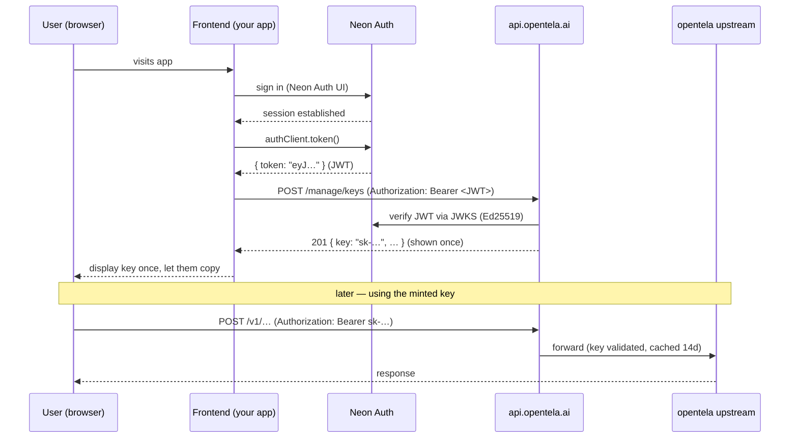

# Frontend Integration — Login, Wallet Linking, and API Keys

How a web frontend logs a user in and mints an opentela API key against
`https://api.opentela.ai`.

## The two tokens (don't confuse them)

There are **two** different credentials in this system:

| Token | What it is | Lifetime | Used to call |
|---|---|---|---|
| **Neon Auth JWT** | Proves *who the user is*. Obtained from Neon Auth after login. EdDSA/Ed25519. | Short (minutes) | **only** `/manage/keys*` |
| **opentela API key** (`sk-…`) | Proves *the caller may use the API*. Minted by `/manage/keys`. | Long (until revoked) | the LLM proxy: `/v1/…` and everything else |

The frontend uses the **JWT** to mint/list/revoke keys. The **`sk-…` key** is
what the user (or their app) then uses to actually call the opentela API. The
backend stores only a SHA-256 hash of each key, so the plaintext `sk-…` is shown
**exactly once**, at creation — surface it to the user immediately and never rely
on getting it again.

## Flow



---

## Prerequisites (backend — one-time, done by an operator)

The `/manage/keys` plane is already deployed and enabled, but three things must
be configured for a browser frontend to use it. **Until these are done, browser
calls will fail** (CORS error or `401`).

1. **Allow the frontend origin (CORS).** Browser calls to `/manage/keys` **and**
   to the proxied LLM endpoints (service-scoped paths under `/v1/*`, e.g.
   `POST /v1/service/llm/v1/chat/completions` or, for the Anthropic API,
   `POST /v1/service/llm/v1/messages`) are cross-origin, so the frontend's exact origin
   must be allow-listed. A single `CORS_ALLOWED_ORIGINS` allowlist governs both
   planes:
   ```bash
   flyctl secrets set CORS_ALLOWED_ORIGINS="https://app.opentela.ai" -a opentela-api
   # multiple origins: comma-separated, e.g. "https://app.opentela.ai,http://localhost:5173"
   ```
   Setting this triggers a redeploy. With it unset, the API sends no
   `Access-Control-Allow-Origin` header and the browser blocks the response.
   Server-to-server callers (no `Origin` header) are unaffected either way.

2. **Register the frontend domain with Neon Auth** (so login/redirects aren't
   rejected with `invalid domain`):
   ```bash
   neon neon-auth domain add https://app.opentela.ai
   neon neon-auth domain allow-localhost      # for local dev
   ```

3. **JWT issuer — already set (verified).** The backend verifies the JWT's `iss`
   exactly against `NEON_AUTH_ISSUER`, which is
   `https://ep-old-cake-as4scnxq.neonauth.c-4.eu-central-1.aws.neon.tech` — the
   **host only, not** the `/neondb/auth` path. (Better Auth sets `iss`/`aud` to the
   host; the `/neondb/auth` base is only where the auth *endpoints* live, i.e.
   `NEON_AUTH_BASE_URL` / `VITE_NEON_AUTH_URL`.) Confirmed end-to-end with a real
   token, so no action needed unless Neon rotates the auth host.

---

## Step 1 — Log the user in with Neon Auth

This project uses **Neon Managed Better Auth**. Install and configure Neon Auth
in the frontend per the Neon quick-start
(<https://neon.com/docs/neon-auth/quick-start>). The essentials:

- Auth client package (e.g. `@neondatabase/neon-js/auth`) plus the UI package
  (`@neondatabase/auth-ui`).
- Point the client at the Neon Auth base URL:
  ```
  VITE_NEON_AUTH_URL=https://ep-old-cake-as4scnxq.neonauth.c-4.eu-central-1.aws.neon.tech/neondb/auth
  ```
- Render Neon Auth's sign-in UI (`<AuthView pathname="sign-in" />` inside
  `<NeonAuthUIProvider authClient={authClient}>`), or build your own with the
  client's auth methods.

Export a configured `authClient` (e.g. from `./auth`) that the rest of the app
imports. Once the user has signed in, a session exists in the browser.

## Step 2 — Get the Neon Auth JWT

Fetch a fresh JWT right before calling the key API (the token is short-lived —
don't cache it):

```js
import { authClient } from "./auth";

async function getAuthJwt() {
  const { data, error } = await authClient.token();
  if (error || !data?.token) throw new Error("Not logged in");
  return data.token; // "eyJ…"  (EdDSA JWT)
}
```

## Step 3 — Mint an API key

`POST https://api.opentela.ai/manage/keys` with the JWT. The response includes
the plaintext `key` **once**.

```js
const API_BASE = "https://api.opentela.ai";

async function createApiKey(jwt, name /* optional, ≤100 chars */) {
  const res = await fetch(`${API_BASE}/manage/keys`, {
    method: "POST",
    headers: {
      Authorization: `Bearer ${jwt}`,
      "Content-Type": "application/json",
    },
    body: JSON.stringify({ name }),
  });

  if (res.status === 401) throw new Error("Not authenticated — JWT missing/expired/invalid");
  if (res.status === 409) throw new Error("Key limit reached (max 10 active keys per user)");
  if (res.status === 400) throw new Error("Bad request (invalid body or name > 100 chars)");
  if (!res.ok)            throw new Error(`Create failed: ${res.status}`);

  // { id, key: "sk-…", prefix: "sk-1a2b3c4d", name, created_at }
  return res.json();
}

// Usage:
const jwt = await getAuthJwt();
const { key, id, prefix } = await createApiKey(jwt, "my-laptop");
// Show `key` to the user NOW and let them copy it. It cannot be retrieved again.
// Persist only `id` / `prefix` / `name` if you keep a local list.
```

## Step 4 — Link verified wallets

Wallets are linked through a server-issued challenge. The browser must sign the
exact `message` returned by `/manage/wallets/challenges`; it must not invent a
client-side challenge.

```js
async function createWalletChallenge(jwt, wallet) {
  const res = await fetch(`${API_BASE}/manage/wallets/challenges`, {
    method: "POST",
    headers: {
      Authorization: `Bearer ${jwt}`,
      "Content-Type": "application/json",
    },
    body: JSON.stringify({ wallet }),
  });
  if (!res.ok) throw new Error(`Challenge failed: ${res.status}`);
  return res.json(); // { id, message, expires_at }
}

async function linkWallet(jwt, challengeId, signature) {
  const res = await fetch(`${API_BASE}/manage/wallets`, {
    method: "POST",
    headers: {
      Authorization: `Bearer ${jwt}`,
      "Content-Type": "application/json",
    },
    body: JSON.stringify({ challenge_id: challengeId, signature }),
  });
  if (res.status === 409) throw new Error("Challenge expired/replayed or wallet already linked");
  if (res.status === 422) throw new Error("Wallet signature did not verify");
  if (!res.ok) throw new Error(`Wallet link failed: ${res.status}`);
  return res.json();
}
```

## Step 5 — Claim instances and replace ACLs

```js
async function createInstance(jwt, peerId, label = "") {
  const res = await fetch(`${API_BASE}/manage/instances`, {
    method: "POST",
    headers: {
      Authorization: `Bearer ${jwt}`,
      "Content-Type": "application/json",
    },
    body: JSON.stringify({ peer_id: peerId, label }),
  });
  if (res.status === 422) throw new Error("Peer is offline or ownership could not be verified");
  if (res.status === 409) throw new Error("Peer is already claimed");
  if (!res.ok) throw new Error(`Create instance failed: ${res.status}`);
  return res.json();
}

async function replaceInstanceAcl(jwt, id, mode, rules) {
  const res = await fetch(`${API_BASE}/manage/instances/${id}/acl`, {
    method: "PUT",
    headers: {
      Authorization: `Bearer ${jwt}`,
      "Content-Type": "application/json",
    },
    body: JSON.stringify({ mode, rules }),
  });
  if (!res.ok) throw new Error(`ACL update failed: ${res.status}`);
  return res.json();
}
```

Rule values the UI should validate before submit:

- `email_domain`: lower-case ASCII DNS domain with exact-match semantics.
- `wallet`: canonical base58 Solana/Ed25519 public key.

## Step 6 — List and revoke keys

```js
async function listApiKeys(jwt) {
  const res = await fetch(`${API_BASE}/manage/keys`, {
    headers: { Authorization: `Bearer ${jwt}` },
  });
  if (!res.ok) throw new Error(`List failed: ${res.status}`);
  // [{ id, name, prefix, created_at, revoked_at }]  — never any plaintext/hash
  return res.json();
}

async function revokeApiKey(jwt, id) {
  const res = await fetch(`${API_BASE}/manage/keys/${id}`, {
    method: "DELETE",
    headers: { Authorization: `Bearer ${jwt}` },
  });
  if (res.status === 404) throw new Error("No such key for this user");
  if (res.status !== 204) throw new Error(`Revoke failed: ${res.status}`);
}
```

A user can only see and revoke **their own** keys — the backend scopes every
query to the JWT's user id, and another user's (or unknown) key id returns `404`.

## Step 7 — Use the minted key

The `sk-…` key — **not** the JWT — authenticates real API calls, which the proxy
validates (cached 14 days) and forwards to the opentela upstream. Generation
paths are **service-scoped** — `/v1/service/<service>/v1/…`, with service names
and model names from the public `GET /v1/services` catalogue:

```js
await fetch("https://api.opentela.ai/v1/service/llm/v1/chat/completions", {
  method: "POST",
  headers: {
    Authorization: `Bearer ${apiKey}`, // the sk-… key (or `x-api-key: ${apiKey}`, Anthropic style)
    "Content-Type": "application/json",
  },
  body: JSON.stringify({ model: "<model from /v1/services>", messages: [/* … */] }),
});
```

The same service prefix serves the Anthropic Messages API
(`POST /v1/service/llm/v1/messages`) for Anthropic SDK clients and Claude Code —
see “Using with Claude Code (Anthropic Messages API)” in `README.md`.

From a browser, this `/v1/*` call is cross-origin, so the frontend origin must be
in `CORS_ALLOWED_ORIGINS` (prereq #1) — the proxy plane is CORS-enabled with the
same allowlist as `/manage/`, and the credential-less preflight `OPTIONS` is
answered before auth.

Note: revocation is not instant — a revoked key may keep working until its 14-day
cache entry expires or the server restarts.

---

## Endpoint reference

Base URL: `https://api.opentela.ai`. All `/manage/keys*` calls require
`Authorization: Bearer <Neon Auth JWT>`.

| Method | Path | Body | Success | Errors |
|---|---|---|---|---|
| `POST` | `/manage/keys` | `{"name":"…"}` (optional) | `201` `{id,key,prefix,name,created_at}` | `401` `409` (cap) `400` (bad body) `503` |
| `GET` | `/manage/keys` | — | `200` `[{id,name,prefix,created_at,revoked_at}]` | `401` `503` |
| `DELETE` | `/manage/keys/{id}` | — | `204` | `401` `404` (not owner/unknown) `400` (bad id) |
| `OPTIONS` | `/manage/keys` | — | `204` (CORS preflight) | — |

CORS applies to **both** planes — the `/manage/` management plane and the `/v1/*`
proxy plane — with identical policy: allowed methods
`GET, POST, PUT, PATCH, DELETE, OPTIONS`; allowed headers
`Authorization, Content-Type, X-Api-Key, Anthropic-Version, Anthropic-Beta`;
origins per `CORS_ALLOWED_ORIGINS`.
A credential-less preflight `OPTIONS` on either plane is answered `204` before
auth, so it never needs a token.

## Notes & gotchas

- **Two cross-origin hops.** The frontend talks to *Neon Auth* (login,
  `authClient.token()`) **and** to *api.opentela.ai* (mint keys). The first is
  gated by Neon Auth's trusted-domains list (prereq #2); the second by our
  `CORS_ALLOWED_ORIGINS` (prereq #1). Both must include your frontend origin.
- **Show the key once.** Only `POST /manage/keys` ever returns the plaintext.
  `GET` returns just a non-secret `prefix` (e.g. `sk-1a2b3c4d`) for display.
- **Refresh the JWT per request.** Call `authClient.token()` fresh; don't stash
  the JWT — it's short-lived and re-issued cheaply while the session is valid.
- **Per-user cap.** Default 10 active keys per user (`409` when exceeded);
  revoking frees a slot. Configurable via `MAX_KEYS_PER_USER` on the backend.
- **Don't send the JWT to `/v1/…`, and don't send `sk-…` to `/manage/…`.** They
  are validated by different mechanisms on different paths.

---

## Appendix — getting a JWT without a frontend (testing/CI)

You don't need the app to obtain a real JWT — hit the Neon Auth (Better Auth)
endpoints directly. The request must carry an `Origin` header matching a trusted
domain (prereq #2), e.g. `http://localhost:3000`:

```bash
BASE="https://ep-old-cake-as4scnxq.neonauth.c-4.eu-central-1.aws.neon.tech/neondb/auth"
JAR=$(mktemp)

# 1. Create a user once (or POST /sign-in/email for an existing one):
curl -sS -c "$JAR" -X POST "$BASE/sign-up/email" \
  -H 'Content-Type: application/json' -H 'Origin: http://localhost:3000' \
  -d '{"email":"you@example.com","password":"<pw>","name":"You","callbackURL":"http://localhost:3000/"}'

# 2. Exchange the session cookie for a JWT:
curl -sS -b "$JAR" -H 'Origin: http://localhost:3000' "$BASE/token"
# -> {"token":"eyJ…"}   (EdDSA, ~15 min lifetime)
```

Send that `token` as `Authorization: Bearer <token>` to `/manage/keys`. In the
app, `authClient.token()` returns the same thing. The token's `iss`/`aud` is the
**host** `https://ep-old-cake-as4scnxq.neonauth.c-4.eu-central-1.aws.neon.tech`
and `sub` is the Neon Auth user id (the key owner).
